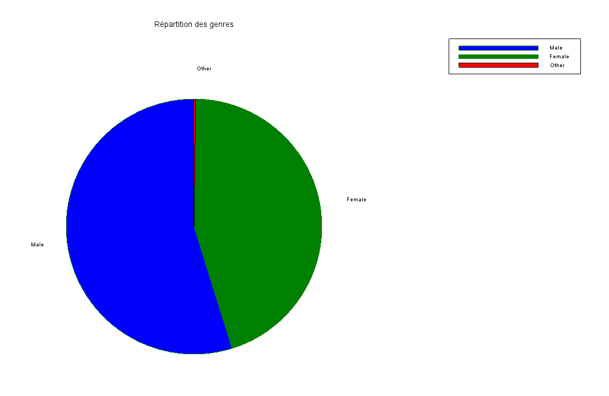
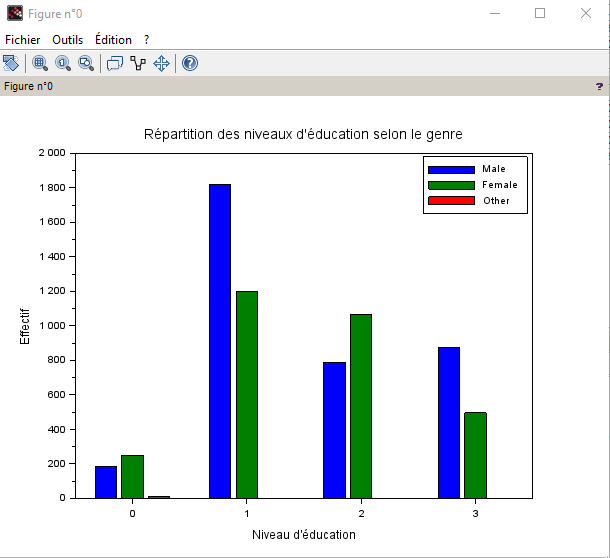
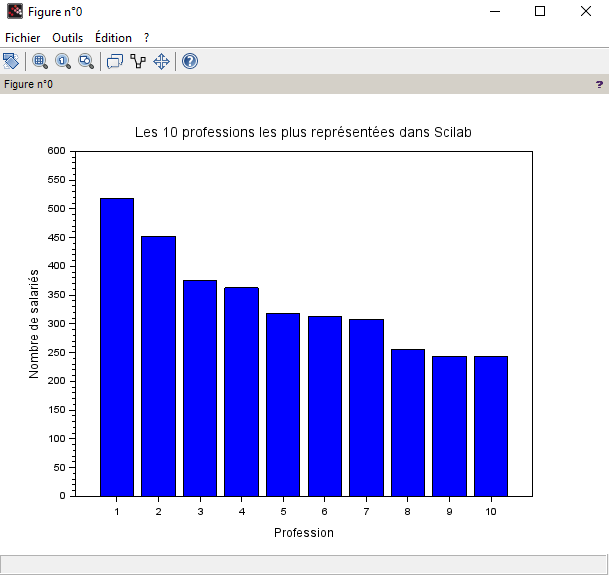
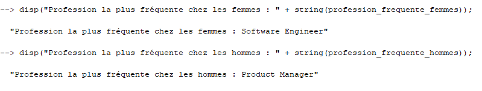

1.1

1.2

1.3:

1.4

1.5:

| Niveau      |  Âge moyen     |  Expérience moyenne      |  Salaire moyen     | 
| :---        |   :---        |     :---        |   :---        | 
| High School |      26.85 |                 1.92 |      36706.69
| Bachelor  |    30.26 |                 5.42 |      95082.91
| Master |  35.17 |                 9.65 |     130112.06
| PhD |  41.15 |                13.92 |     165651.46

1.6:

| Genre     |  Âge moyen     |  Expérience moyenne      |  Salaire moyen     | 
| :---        |   :---        |     :---        |   :---        | 
| Homme |     34.41  |                 8.62 |      125869.86
| Femme |    32.63 |               7.42   |      107889
| Other |  39.60 |                 9.65 |    125869.86
