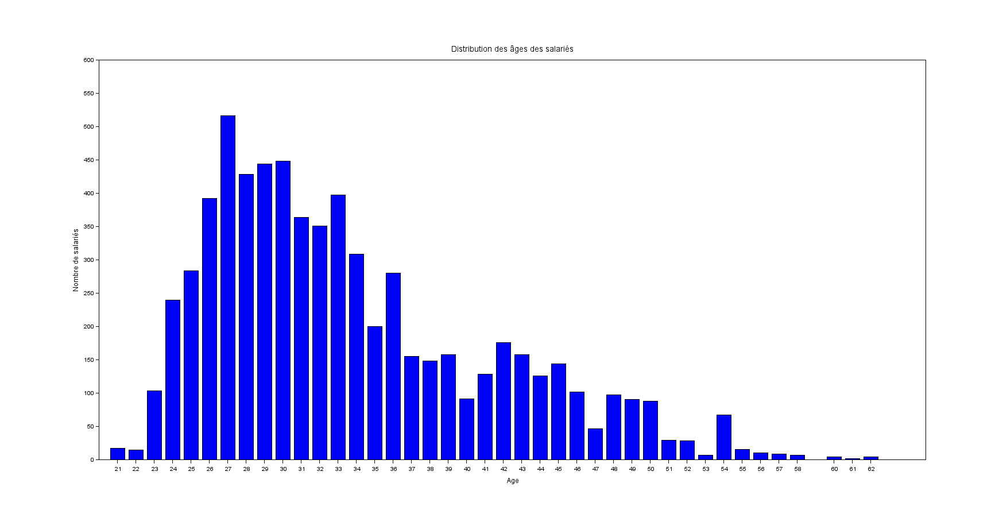
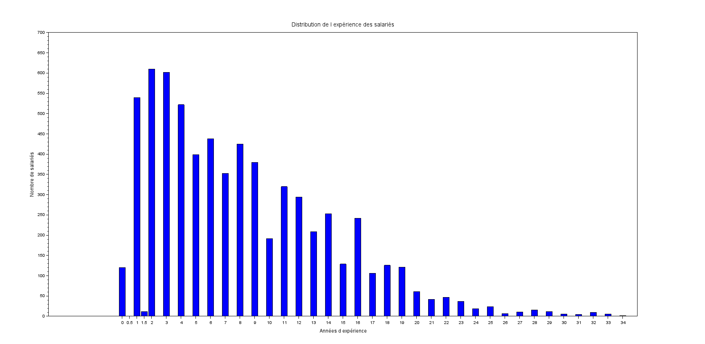
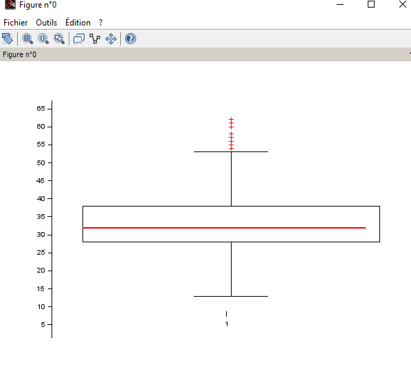
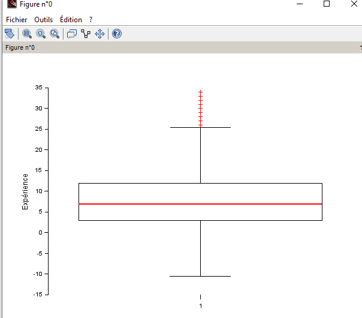

2.1:

2.2:

**Question 2.3**

disp("L âge minimum est : " + string(min_age));

  **"L âge minimum est : 21"**

--> disp("L âge maximum est : " + string(max_age));

 ** "L âge maximum est : 62"**

--> disp("L âge moyen est : " + string(moyenne_age));

  **"L âge moyen est : 33.622033"**

--> disp("La médiane de l âge est : " + string(mediane_age));

  **"La médiane de l âge est : 32"**

--> disp("Les quartiles de l âge sont : " + string(quartile_age));

  **"Les quartiles de l âge sont : 28"**
  **"Les quartiles de l âge sont : 32"**
  **"Les quartiles de l âge sont : 38"**

--> disp("L écart interquartile de l âge est : " + string(interquatile_age));

  **"L écart interquartile de l âge est : 10"**

--> // Calcul de l'âge le plus fréquent

M = tabul(age, "i");
[max_freq, ind_max] = max(M(:, 2));
most_frequent_age = M(ind_max, 1);
disp("L âge qui se répète le plus souvent est : " + string(most_frequent_age));

  **"L âge qui se répète le plus souvent est : 27"**

--> // Calcul de l'écart type de l'âge

std_age = stdev(age);
disp("L écart type de l âge est : " + string(std_age));

  **"L écart type de l âge est : 7.6156456"**

  **Question 2.4**

  **Question 2.5**

  --> disp("L expérience minimum est : " + string(min_experience));

  **"L expérience minimum est : 0"**

--> disp("L expérience maximum est : " + string(max_experience));

  **"L expérience maximum est : 34"**

--> disp("L expérience moyenne est : " + string(moyenne_experience));

  **"L expérience moyenne est : 8.0950142"**

--> disp("La médiane de l expérience est : " + string(mediane_experience));

 **"La médiane de l expérience est : 7"**

--> disp("Les quartiles de l expérience sont : " + string(quartile_experience));

  **"Les quartiles de l expérience sont : 3"**
  **"Les quartiles de l expérience sont : 7"**
  **"Les quartiles de l expérience sont : 12"**

--> disp("L écart interquartile de l expérience est : " + string(interquatile_experience));

  **"L écart interquartile de l expérience est : 9"**

--> // Calcul de l'expérience la plus fréquente

M = tabul(experience, "i");
[max_freq, ind_max] = max(M(:, 2));
most_frequent_experience = M(ind_max, 1);
disp("L expérience qui se répète le plus souvent est : " + string(most_frequent_experience));

  **"L expérience qui se répète le plus souvent est : 2"**

--> // Calcul de l'écart type de l'expérience
std_experience = stdev(experience);
 disp("L écart type de l expérience est : " + string(std_experience));

  **"L écart type de l expérience est : 6.0598534"**

