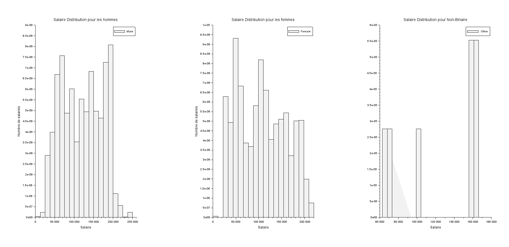
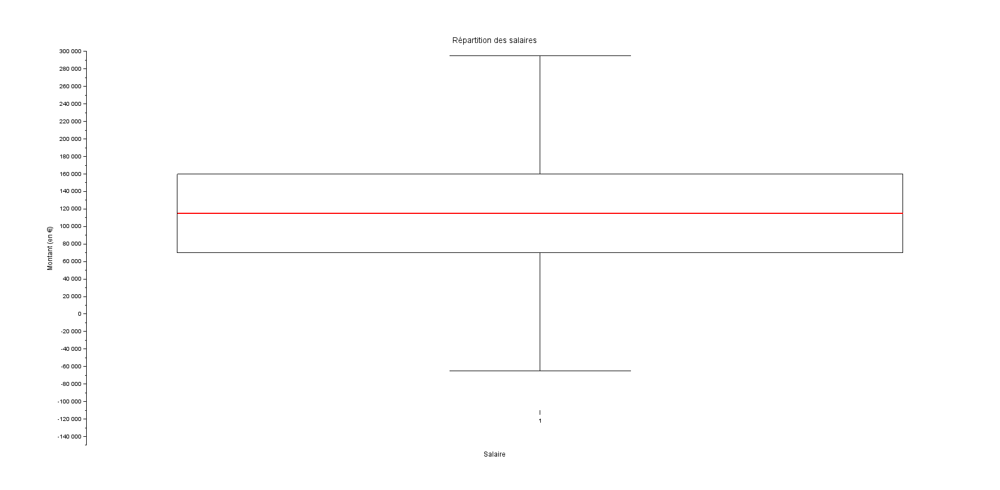
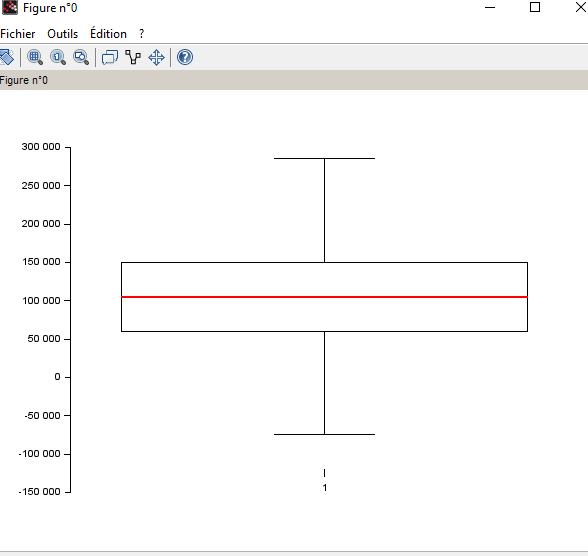
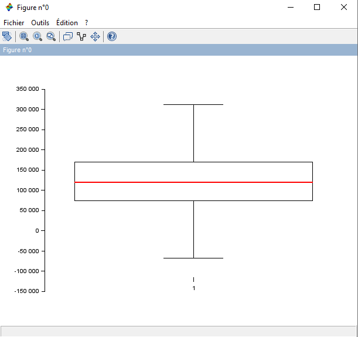
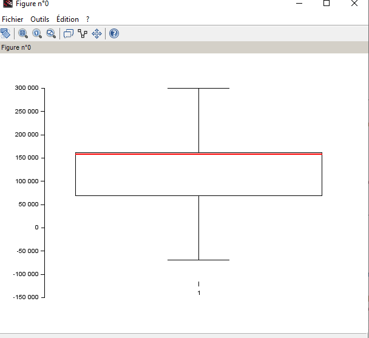

**Question 3.1**

**Question 3.2**

Nous n'avons pas réussi 

**Question 3.3**

  **Min salaire : 350 €**

  **Max salaire : 250000 €**

  **Moyenne salaire : 115326.96 €**

  **Médiane salaire : 115000 €**

  **Quartiles des salaires : 70000 €**

  **Quartiles des salaires : 115000 €**

  **Quartiles des salaires : 160000 €**

  **Intervalle interquartile des salaires : 90000 €**

  **Le mode : Le salaire qui se répète le plus souvent est : 140000 €**

  **Écart-type des salaires : 52786.184 €**

  **Boite à moustache**

**Question 3.4**

**Femmme**

 **Min: 500**

 **Max: 220000**

 **Moyenne: 107889**

 **Mediane: 105000**

**Quartiles: 60000**
**Quartiles: 105000**
**Quartiles: 150000**

**Interquartile: 90000**

  **Ecart type: 52723.61**

  **Homme**

  

**Min: 350**

**Max: 250000**

**Moyenne: 121389.87**

**Mediane: 120000**

**Quartiles: 75000**

**Quartiles: 120000**

**Quartiles: 170000**

**Interquartile: 95000**

**Ecart type: 52092.726**

**Other**

 

  **Min: 62852**

  **Max: 166109**

 ** Moyenne: 125869.86**

 ** Mediane: 158610**

 **Quartiles: 69032**

  **Quartiles: 158610**

  **Quartiles: 161393**

  **Interquartile: 92361**

  **Ecart type: 44242.383**

  **Le salaire des autres genres qui se répète le plus souvent est : 158966**

**Commentaire**
  
1. Disparité des Salaires :

La médiane des salaires des hommes est de 120 000, tandis que celle des femmes est de 105 000. Cela montre une différence de 15 000 en faveur des hommes. Cette différence peut refléter des disparités salariales entre les genres.
La moyenne des salaires est également plus élevée pour les hommes (121 389,87) comparée aux femmes (107 889), renforçant l'observation de la disparité salariale.

2. Distribution des Salaires :

Les salaires des hommes et des femmes montrent des distributions différentes. Les quartiles pour les hommes sont 75 000 (Q1), 120 000 (médiane), et 170 000 (Q3), alors que pour les femmes, ils sont 60 000 (Q1), 105 000 (médiane), et 150 000 (Q3).
L'intervalle interquartile (IQR) des hommes est de 95 000, tandis que celui des femmes est de 90 000, indiquant une dispersion légèrement plus grande pour les salaires des hommes.

3. Extrêmes des Salaires :

Le salaire minimum pour les hommes est de 350, et le maximum est de 250 000. Pour les femmes, le minimum est de 500, et le maximum est de 220 000.
La présence de salaires très bas dans les deux genres pourrait indiquer des emplois à temps partiel ou des stages. Les salaires maximaux montrent que les hommes atteignent des postes mieux rémunérés comparés aux femmes.

4. Variabilité des Salaires :

L'écart type des salaires des hommes est de 52 092,726, et celui des femmes est de 52 723,61. Ces valeurs montrent que la variabilité des salaires est assez similaire entre les genres, bien que légèrement plus élevée pour les femmes.
