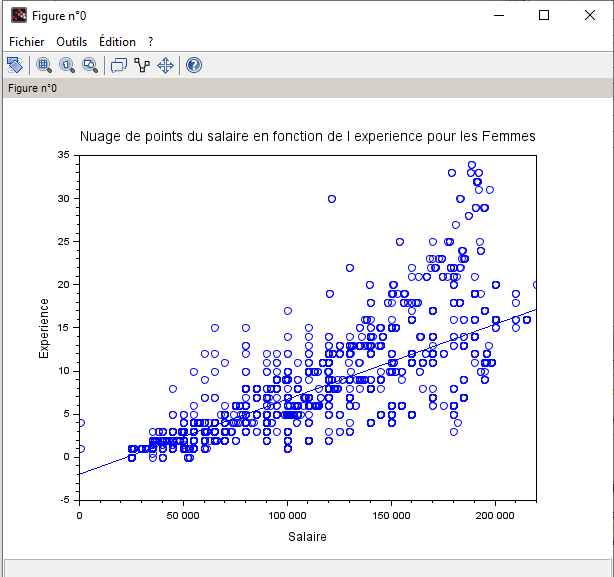

**Question 5.1**

**Distribution Générale:**

Hommes: Les points représentant les hommes sont concentrés vers la droite de régression, ce qui indique une tendance à avoir plus d'hommes avec une expérience et des salaires plus élevés.

Femmes: Les points représentant les femmes sont plus dispersés sur l'ensemble du graphique, ce qui suggère une plus grande variation dans les salaires et l'expérience parmi les femmes.

**Dispersion:**

La dispersion des points est plus grande pour les femmes que pour les hommes. Cela signifie que pour les femmes, les salaires varient beaucoup plus pour un même niveau d'expérience par rapport aux hommes.

Pour les hommes, les points sont fortement concentrés autour de la droite de régression, indiquant une relation plus cohérente entre l'expérience et le salaire.

**Droites de Régression:**

La Droites de régression pour les hommes est bien définie et les points sont étroitement groupés autour de cette droite, ce qui suggère une forte corrélation entre l'expérience et le salaire.

En revanche, pour les femmes, la droite de régression montre une plus grande dispersion des points, ce qui indique une relation moins prévisible entre l'expérience et le salaire.

**Tendance Générale:**

La tendance générale pour les hommes montre que les salaires augmentent de manière plus uniforme avec l'expérience.

Pour les femmes, malgré l'augmentation des salaires avec l'expérience, la plus grande dispersion des points suggère que d'autres facteurs peuvent influencer leurs salaires plus fortement que pour les hommes.

**Question 5.1**

**Pour High_School**

**Pour Bachelor**

**Pour Master**

**Pour PhD**

